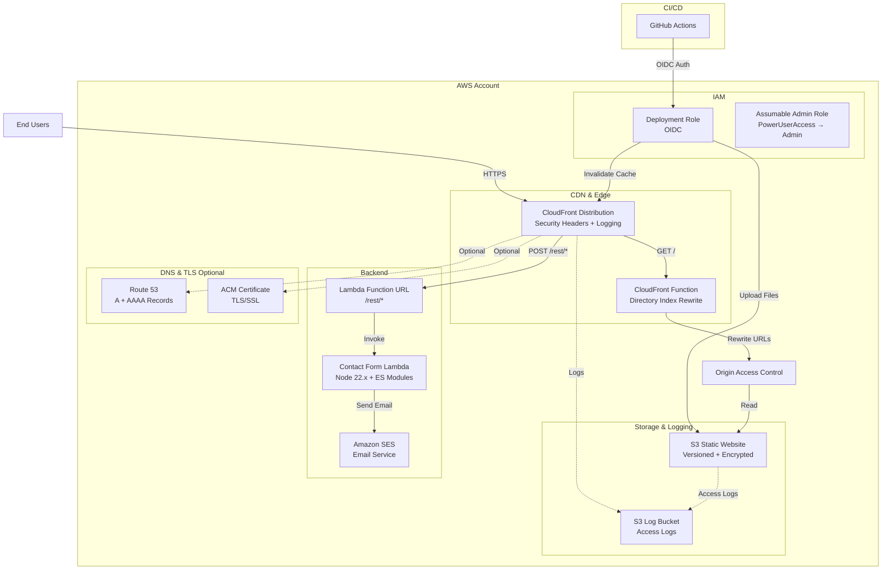

# fredjean-net-cdk

CDK package to create the infrastructure for a production-ready static website on AWS with CloudFront CDN, Lambda-based contact forms, and CI/CD via GitHub Actions.

## Architecture



## Features

### Core Infrastructure
- ✅ **S3** for static website hosting with versioning and encryption
- ✅ **CloudFront** CDN with security headers (CSP, HSTS, X-Frame-Options)
- ✅ **Lambda Function URL** for serverless contact form (Node.js 22.x)
- ✅ **CloudFront Functions** for directory index rewriting (clean URLs)
- ✅ **Origin Access Control** (OAC) for secure S3 access
- ✅ **ACM SSL/TLS certificates** (optional)
- ✅ **Route53 DNS** with IPv4 (A) and IPv6 (AAAA) records (optional)

### Security
- 🔒 S3 bucket with public access blocked
- 🔒 HTTPS enforced via CloudFront
- 🔒 Security headers: CSP, HSTS, X-Frame-Options, XSS Protection
- 🔒 IAM roles with least privilege (OIDC for GitHub Actions)
- 🔒 Assumable admin role for privilege escalation (PowerUserAccess → Admin)
- 🔒 Lambda input validation and sanitization
- 🔒 CORS configuration for Lambda Function URLs

### Observability
- 📊 CloudFront access logs to S3
- 📊 S3 server access logs
- 📊 Lambda structured JSON logging with request IDs
- 📊 S3 versioning with 30-day retention for old versions

### Developer Experience
- 🚀 GitHub Actions OIDC integration (no long-lived credentials)
- 🚀 CDK Infrastructure as Code
- 🚀 TypeScript with comprehensive tests
- 🚀 Mise task automation (`mise run deploy`, `mise run test`)
- 🚀 Hotswap deployments for rapid Lambda iteration

## Quick Start

### 1. Clone and Install

```bash
git clone https://github.com/fredjean/fredjean-net-cdk.git
cd fredjean-net-cdk
npm install
```

### 2. Bootstrap AWS Account (first time only)

```bash
npx cdk bootstrap
```

### 3. Deploy the Infrastructure

```bash
npm run build
npx cdk deploy
```

### 4. Upload Your Website

After deployment, upload your static website files:

```bash
# Get the bucket name from CDK outputs
aws s3 sync ./your-website s3://YOUR-BUCKET-NAME
```

That's it! Your website is now live on CloudFront.

## Prerequisites

- Node.js 20.x or later
- npm 10.x or later
- AWS CLI configured with appropriate credentials
- AWS CDK CLI (`npm install -g aws-cdk`)

## Installation

```bash
npm install
```

## Configuration

The stack accepts the following optional parameters:

- `domainName`: Your custom domain (e.g., `fredjean.net`)
- `hostedZoneId`: Route53 hosted zone ID for your domain
- `certificateArn`: ARN of an ACM certificate (must be in us-east-1 for CloudFront)

You can configure these in `bin/fredjean-net-cdk.ts`.

## Usage

### Build

```bash
npm run build
```

### Test

```bash
npm test
```

### Deploy

First, bootstrap your AWS account for CDK (if not already done):

```bash
cdk bootstrap
```

Then deploy the stack:

```bash
cdk deploy
```

### View Differences

Before deploying, you can preview what will be created:

```bash
cdk diff
```

### Synthesize CloudFormation Template

To see the CloudFormation template that will be deployed:

```bash
cdk synth
```

## GitHub Actions Setup

### 1. Create OIDC Provider

First, create an OIDC provider in your AWS account for GitHub Actions:

```bash
aws iam create-open-id-connect-provider \
  --url https://token.actions.githubusercontent.com \
  --client-id-list sts.amazonaws.com \
  --thumbprint-list 6938fd4d98bab03faadb97b34396831e3780aea1
```

### 2. Deploy the Stack

Deploy the CDK stack which will create the deployment role:

```bash
cdk deploy
```

### 3. Configure GitHub Secrets

Add the following secrets to your GitHub repository:

- `AWS_ROLE_ARN`: The ARN of the deployment role (from CDK outputs)
- `AWS_REGION`: The AWS region (e.g., `us-east-1`)

### 4. Update Trust Policy

After deployment, update the GitHub deployment role's trust policy to restrict it to your specific repository. See [GITHUB_ACTIONS_SETUP.md](GITHUB_ACTIONS_SETUP.md) for detailed instructions.

For a complete step-by-step guide, see **[GitHub Actions Setup Guide](GITHUB_ACTIONS_SETUP.md)**.

## Deploying Website Content

Once the infrastructure is deployed, you can upload your static website files to the S3 bucket:

```bash
# Upload files
aws s3 sync ./your-website-files s3://YOUR-BUCKET-NAME

# Invalidate CloudFront cache
aws cloudfront create-invalidation \
  --distribution-id YOUR-DISTRIBUTION-ID \
  --paths "/*"
```

## Contact Form Lambda

The stack includes a production-ready contact form Lambda function:

### Features
- **Modern ES Modules** (`.mjs`) with Node.js 22.x runtime
- **Comprehensive validation** with field-specific error messages
- **Input sanitization** against injection attacks
- **SES email integration** with configurable addresses
- **Structured JSON logging** with request IDs for CloudWatch
- **CORS support** for cross-origin requests
- **Lambda Function URL** (no API Gateway needed)
- **34 unit tests** covering all edge cases

### API Endpoint

The contact form is accessible at `https://your-domain.com/rest/*` via CloudFront.

**Request:**
```bash
curl -X POST https://your-domain.com/rest/contact \
  -H "Content-Type: application/json" \
  -d '{
    "name": "John Doe",
    "email": "john@example.com",
    "phone": "555-1234",
    "message": "Your message here"
  }'
```

**Response (Success):**
```json
{
  "message": "Thank you for contacting us! Your message has been sent.",
  "success": true
}
```

**Response (Validation Error):**
```json
{
  "error": "email contains invalid characters",
  "field": "email"
}
```

### Testing

```bash
cd lambda/contact-form
npm install
npm test              # Run all tests
npm run test:watch    # Watch mode
npm run test:coverage # Coverage report
```

See [`lambda/contact-form/README.md`](lambda/contact-form/README.md) for detailed documentation.

## Mise Task Automation

This project uses [mise](https://mise.jdx.dev/) for task automation. Common tasks:

```bash
# Install dependencies
mise run install

# Build TypeScript
mise run build

# Run tests
mise run test

# Deploy to AWS
mise run deploy

# Deploy with hotswap (fast Lambda updates)
mise run deploy:hotswap

# Show diff before deploying
mise run diff

# Synthesize CloudFormation
mise run synth

# Full dev workflow (build + test + synth)
mise run dev

# Validate changes
mise run validate
```

See [`mise.toml`](mise.toml) for all available tasks.

## Stack Outputs

After deployment, the stack provides these outputs:

- **BucketName**: S3 bucket name for website content
- **DistributionId**: CloudFront distribution ID
- **DistributionDomainName**: CloudFront URL for your website
- **ContactFormUrl**: Lambda Function URL for contact form
- **DeploymentRoleArn**: IAM role ARN for GitHub Actions

## Project Structure

```
.
├── bin/
│   └── fredjean-net-cdk.ts           # CDK app entry point
├── lib/
│   ├── static-website-stack.ts       # Main website stack
│   ├── admin-role-stack.ts           # Assumable admin role
│   └── directory-index-rewrite.js    # CloudFront Function for clean URLs
├── lambda/
│   └── contact-form/
│       ├── index.mjs                 # Lambda handler (ES modules)
│       ├── index.test.mjs            # Comprehensive unit tests
│       ├── package.json              # Lambda dependencies
│       └── README.md                 # Lambda documentation
├── test/
│   └── static-website-stack.test.ts  # CDK stack tests
├── .github/
│   └── workflows/
│       └── deploy.yml                # GitHub Actions workflow
├── mise.toml                         # Task automation config
├── cdk.json                          # CDK configuration
├── tsconfig.json                     # TypeScript configuration
└── package.json                      # Node.js dependencies
```

## Customization

To customize the stack for your domain, edit `bin/fredjean-net-cdk.ts`:

```typescript
new StaticWebsiteStack(app, 'FredjeanNetStack', {
  env: { 
    account: process.env.CDK_DEFAULT_ACCOUNT, 
    region: process.env.CDK_DEFAULT_REGION 
  },
  domainName: 'fredjean.net',
  hostedZoneId: 'Z1234567890ABC',
  certificateArn: 'arn:aws:acm:us-east-1:123456789012:certificate/...',
});
```

## Security Features

- S3 bucket has public access blocked
- HTTPS enforced on CloudFront
- S3 bucket requires SSL for all connections
- Origin Access Control used instead of Origin Access Identity
- IAM role follows principle of least privilege

## Cost Considerations

- **S3**: Pay for storage and requests
- **CloudFront**: Free tier includes 1TB data transfer out and 10M requests per month
- **Route53**: $0.50/month per hosted zone (if used)
- **ACM**: Free for public certificates

## Cleanup

To delete all resources created by this stack:

```bash
cdk destroy
```

**Note**: The S3 bucket has a `RETAIN` removal policy, so it won't be automatically deleted. You'll need to empty and delete it manually if desired.

## License

ISC
