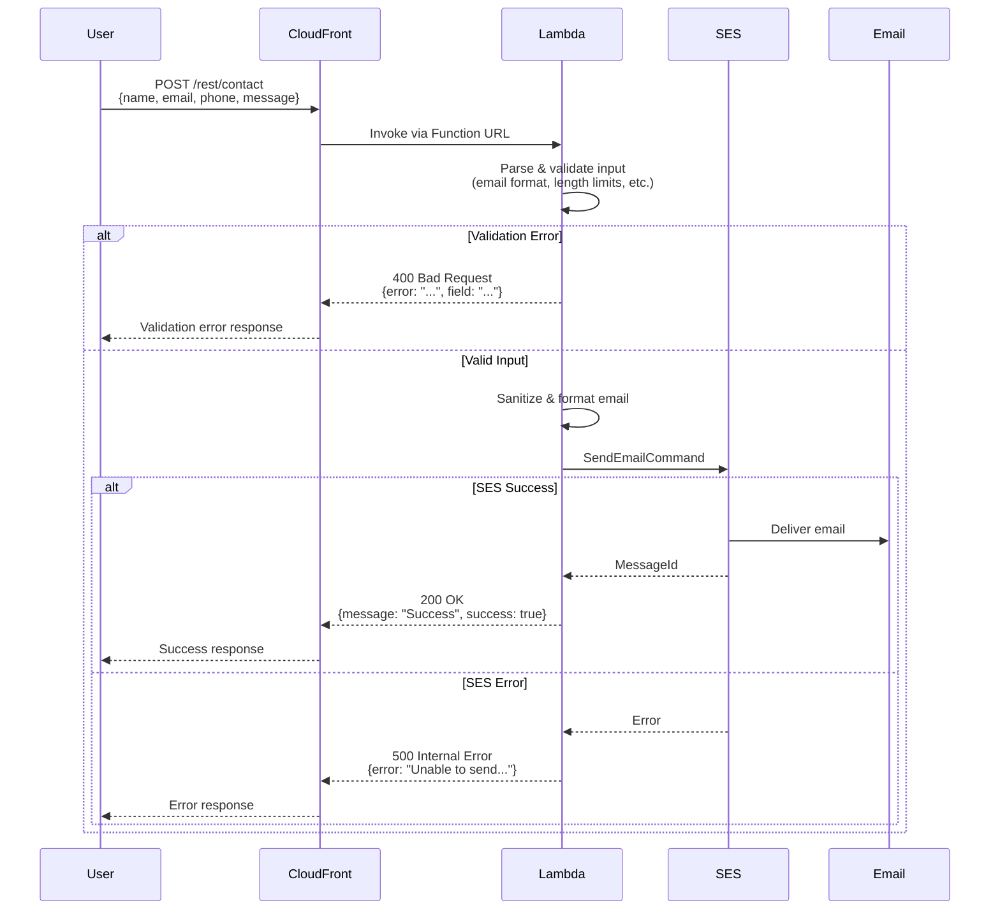
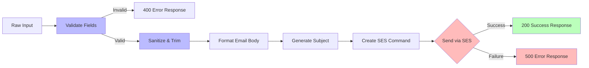

# Contact Form Lambda Handler

Modern, testable AWS Lambda function for handling contact form submissions via AWS SES.

## Architecture



## Data Flow



## Key Improvements Over Legacy Version

### 1. **Modern JavaScript (ES Modules)**
- Uses ES6+ syntax with `import/export`
- Arrow functions and modern patterns
- Template literals instead of string concatenation

### 2. **Testability**
- **Dependency injection** - SES client can be mocked for tests
- **Pure functions** - Validation, formatting, and utility functions are exported and testable
- **No global state** - All dependencies passed as parameters
- **Comprehensive tests** - Unit tests with Vitest

### 3. **Configuration via Environment Variables**
- No hard-coded email addresses
- Configurable limits and settings
- Environment-specific configuration

### 4. **Better Security**
- Input sanitization with Unicode-aware patterns
- Field-specific validation rules
- Protection against injection attacks
- Length limits on all inputs
- Trimming of whitespace

### 5. **Improved Error Handling**
- Custom `ValidationError` class
- Field-specific error messages
- Structured JSON logging with request IDs
- Graceful SES error handling
- No internal error exposure to clients

### 6. **Better Logging**
- Structured JSON logs
- Request ID tracking for debugging
- Log levels (info, warn, error)
- CloudWatch-friendly format

### 7. **CORS Handling**
- Proper OPTIONS request handling
- Configurable allowed origins
- Consistent CORS headers

### 8. **Code Organization**
- Single Responsibility Principle
- Separated concerns (validation, formatting, sending)
- DRY - No repetitive response building
- Well-documented with JSDoc comments

## Running Tests

```bash
# Install dependencies (in lambda/contact-form directory)
cd lambda/contact-form
npm install

# Run tests
npm test

# Watch mode
npm run test:watch

# Coverage report
npm run test:coverage
```

## Environment Variables

| Variable | Default | Description |
|----------|---------|-------------|
| `TO_ADDRESS` | `Fred Jean <fred@fredjean.net>` | Recipient email address |
| `FROM_ADDRESS` | `Contact Form <hello@fredjean.net>` | Sender email address (must be SES verified) |
| `ALLOWED_ORIGIN` | `*` | CORS allowed origin |
| `AWS_REGION` | `us-east-1` | AWS region for SES |
| `MAX_MESSAGE_LENGTH` | `2048` | Maximum message length |
| `MAX_NAME_LENGTH` | `100` | Maximum name length |
| `MAX_PHONE_LENGTH` | `20` | Maximum phone length |
| `SUBJECT_WORD_COUNT` | `8` | Number of words in email subject |

## API

### Request

```json
{
  "name": "John Doe",
  "email": "john@example.com",
  "phone": "555-1234",
  "message": "This is my message"
}
```

### Success Response (200)

```json
{
  "message": "Thank you for contacting us! Your message has been sent.",
  "success": true
}
```

### Error Response (400)

```json
{
  "error": "email contains invalid characters",
  "field": "email"
}
```

### Error Response (500)

```json
{
  "error": "Unable to send message. Please try again later."
}
```

## Validation Rules

### Email
- Required
- Max 255 characters
- Must match pattern: `[text]@[domain].[tld]`

### Name
- Required
- Max 100 characters (configurable)
- Only Unicode letters, spaces, hyphens, apostrophes
- Example: `José María O'Brien-López` ✅
- Example: `John123` ❌

### Phone
- Required
- Max 20 characters (configurable)
- Only digits, spaces, `+`, `(`, `)`, `-`
- Example: `+1 (555) 123-4567` ✅
- Example: `555-CALL` ❌

### Message
- Required
- Max 2048 characters (configurable)
- Unicode letters, numbers, punctuation, whitespace
- Trimmed before validation

## Migration from Old Version

The old `index.js` (CommonJS) is still present for backwards compatibility. To migrate:

1. Update CDK stack to use `index.mjs`
2. Add environment variables to Lambda configuration
3. Deploy the stack
4. Test the new endpoint
5. Remove old `index.js` file

The new version is **100% backwards compatible** with the same API contract.

## Local Development

```javascript
import { handler } from './index.mjs';

// Mock event
const event = {
  body: JSON.stringify({
    name: 'Test User',
    email: 'test@example.com',
    phone: '555-1234',
    message: 'Test message'
  })
};

// Mock context
const context = {
  requestId: 'test-123'
};

// Mock SES client
const mockSES = {
  send: async (command) => {
    console.log('Would send email:', command);
    return { MessageId: 'test-id' };
  }
};

const response = await handler(event, context, mockSES);
console.log(response);
```

## Performance

- Cold start: ~200-300ms
- Warm execution: ~50-100ms
- Memory: 128MB (configurable)
- Timeout: 10 seconds

## Security Considerations

1. **Rate Limiting** - Consider adding AWS WAF rules or API Gateway throttling
2. **Honeypot Fields** - Consider adding hidden fields to catch bots
3. **reCAPTCHA** - Consider adding Google reCAPTCHA verification
4. **Email Verification** - Consider verifying email addresses before sending
5. **Spam Detection** - Consider integrating with spam detection services

## Troubleshooting

### "sesClient.send is not a function" Error

This error occurred during initial deployment due to Lambda runtime quirks. **Fixed** by:

1. Removing default parameter value from `sesClient`
2. Adding type checking: `(sesClient && typeof sesClient === 'object')`
3. Properly handling Lambda Function URL context (`awsRequestId` vs `requestId`)

The function now correctly handles:
- ✅ `sesClient` being `undefined` (Lambda doesn't pass 3rd parameter)
- ✅ `sesClient` being a function (Lambda runtime quirk)
- ✅ `sesClient` being `null` (test scenarios)
- ✅ Valid SES client object (injected for testing)

### Request ID Shows as "local"

Lambda Function URLs use `context.awsRequestId` instead of `context.requestId`. The handler now checks both:

```javascript
const requestId = context?.awsRequestId || context?.requestId || 'local';
```

### ES Module Conflicts

Ensure there's no stray `index.js` file in the Lambda directory. The function uses:
- `index.mjs` (ES module format)
- `package.json` with `"type": "module"`
- Node.js 22.x runtime

### Testing Locally

All 34 tests pass and cover edge cases:

```bash
cd lambda/contact-form
npm install
npm test
```

Tests validate:
- Field validation (email, name, phone, message)
- Input sanitization and trimming
- SES client creation under various conditions
- Context handling (awsRequestId, requestId, null)
- Lambda Function URL event format
- Error handling (validation, SES failures)
- CORS headers
- Request ID logging

## Future Enhancements

- [ ] Add rate limiting per IP
- [ ] Add honeypot field validation
- [ ] Add reCAPTCHA v3 integration
- [ ] Add email template support (HTML emails)
- [ ] Add file attachment support
- [ ] Add notification to Slack/Discord
- [ ] Add database logging of submissions
- [ ] Add duplicate submission detection
- [ ] Add admin API for viewing submissions
